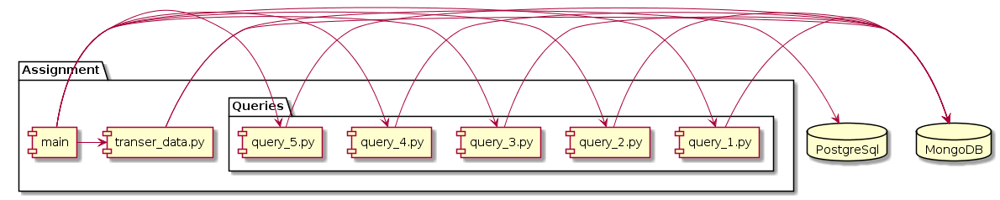

# DMD2 Assignment 1
Assignment of Ryibin Ivan at Innopolis University.

## Running
In order to build containers and run transfer and queries, use this command:
``` sh
$ ACTOR_ID=3 CUSTOMER_ID=524 docker-compose up --build --abort-on-container-exit
```

## Navigation
* In [postgree](./postgree) directory there is everything related to postgresql dump
* In [assignment](./assignment) directory there is everything related to postgresql dump
 + Everything is called from [main](./assignment/main)
 + Transfer from postgres to mongo is in [transfer_data.py](./assignment/transfer_data.py)
 + Queries are situated in files query_*.py

## Component diagram

You can take a look at it in UML in [diagram.uml](./diagram.uml).


